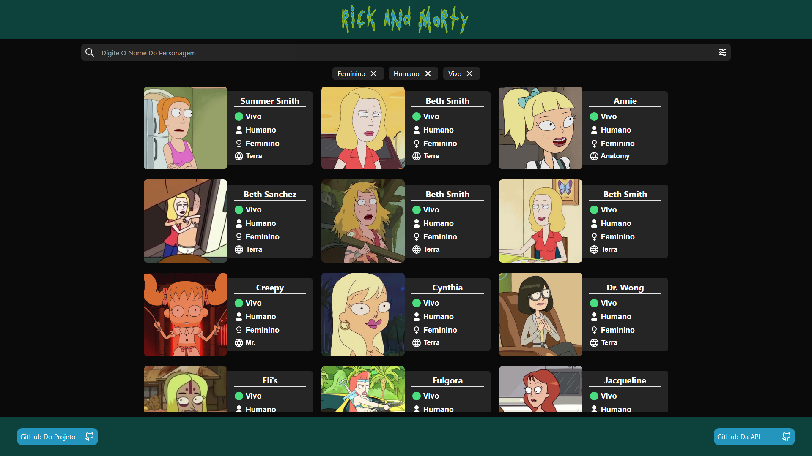

# Rick And Morty

Um Projeto Desenvolvido Com o Objetivo De Praticar o Uso Do Framework [Vue.js](https://vuejs.org/) Consumindo a API Publica Do [Rick And Morty](https://rickandmortyapi.com/) Usando [Axios](https://axios-http.com/) Para Requisições Da API e [Tailwindcss](https://tailwindcss.com/) Para Estilização.

Na Imagem Acima é Possível Ver a Página do Projeto, Onde é Possível Ver Os Personagens da Série em Cards, com Imagem, Nome, Status, Espécie E Gênero. Também é Possível Pesquisar por Nome de Personagens e Filtrar por Espécie, Status e Gênero.

 

